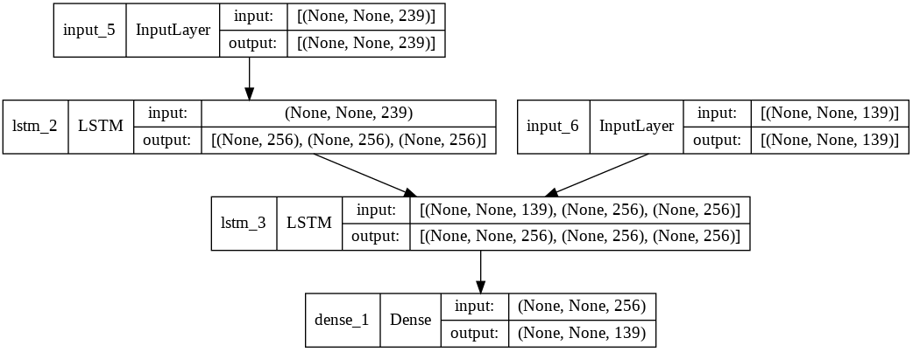
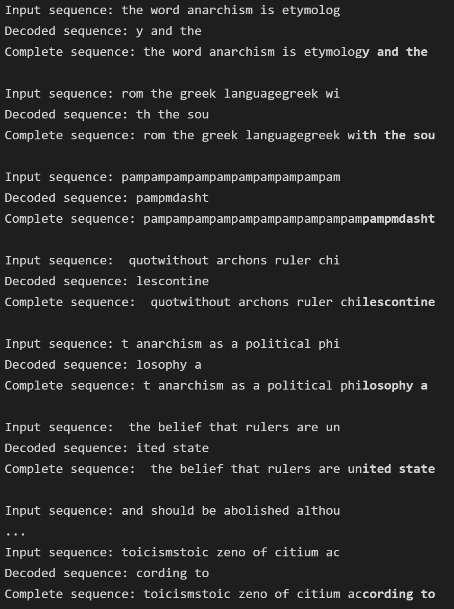
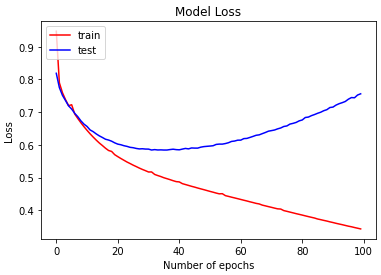

  
  <h3 align="center">Autocomplete Generator</h3>
  

    Utilizing Python's Machine Learning libraries to implement an Autocomplete Generator.
  

  
Table of Contents

  <ol>
    <li>
      <a href="#about-the-project">About The Project</a>
      <ul>
        <li><a href="#built-with">Built With</a></li>
      </ul>
    </li>
    <li><a href="#usage">Usage</a></li>
    <li><a href="#license">License</a></li>
    <li><a href="#sources">Sources</a></li>
  </ol>

## About the Project

A Recurrent Neural Network (RNN) sequence-to-sequence (seq2seq) model was implemented to predict text. The main Python libraries used were TensorFlow and Keras. The well known Hutter Prize Wikipedia Dataset was utilized for the training, validation, and test data. Given a sequence of 30 characters, the model predicts the next 10 characters. The model achieved 89.52% accuracy.

### Built With:
* Python
* Keras
* TensorFlow
* CSV

Simplified seq2seq model example.

System Design of seq2seq model implemented.

## Usage
The input data is first parsed. Each unique character is tokenized to be used later in the model.

The model is then created and fed the tokenized data.

The model is then executed through a set number of epochs, a number times that the learning algorithm will work through the entire training dataset.

The model outputs a decoded sequence, which is the predicted text. The predicted text is bolded as shown below. 

The model's accuracy and loss plot is shown below. The model achieved 89.52% accuracy and a 0.3433 in model loss.

## Sources
* A ten-minute introduction to sequence-to-sequence learning in Keras: [https://blog.keras.io/a-ten-minute-introduction-to-sequence-to-sequence-learning-in-keras.html](https://blog.keras.io/a-ten-minute-introduction-to-sequence-to-sequence-learning-in-keras.html)
* NLP FROM SCRATCH: TRANSLATION WITH A SEQUENCE TO SEQUENCE NETWORK AND ATTENTION: [https://pytorch.org/tutorials/intermediate/seq2seq_translation_tutorial.html](https://pytorch.org/tutorials/intermediate/seq2seq_translation_tutorial.html)
* Machine Translation using Recurrent Neural Network and PyTorch: [http://www.adeveloperdiary.com/data-science/deep-learning/nlp/machine-translation-recurrent-neural-network-pytorch/](http://www.adeveloperdiary.com/data-science/deep-learning/nlp/machine-translation-recurrent-neural-network-pytorch/)
* How to implement Seq2Seq LSTM Model in Keras: [https://towardsdatascience.com/how-to-implement-seq2seq-lstm-model-in-keras-shortcutnlp-6f355f3e5639](https://towardsdatascience.com/how-to-implement-seq2seq-lstm-model-in-keras-shortcutnlp-6f355f3e5639)
* How to Develop a Seq2Seq Model for Neural Machine Translation in Keras: [https://machinelearningmastery.com/define-encoder-decoder-sequence-sequence-model-neural-machine-translation-keras/](https://machinelearningmastery.com/define-encoder-decoder-sequence-sequence-model-neural-machine-translation-keras/) 
* Difference Between a Batch and an Epoch in a Neural Network: [https://machinelearningmastery.com/difference-between-a-batch-and-an-epoch/](https://machinelearningmastery.com/difference-between-a-batch-and-an-epoch/)

### Images
* Accessible Autocomplete Component In Vanilla JavaScript – Autocomplete: [https://www.cssscript.com/accessible-autocomplete-component/](https://www.cssscript.com/accessible-autocomplete-component/)
* Sequence-to-Sequence Modeling using LSTM for Language Translation: [https://analyticsindiamag.com/sequence-to-sequence-modeling-using-lstm-for-language-translation/](https://analyticsindiamag.com/sequence-to-sequence-modeling-using-lstm-for-language-translation/)

## License
Distributed under the MIT License. See `LICENSE` for more information.

